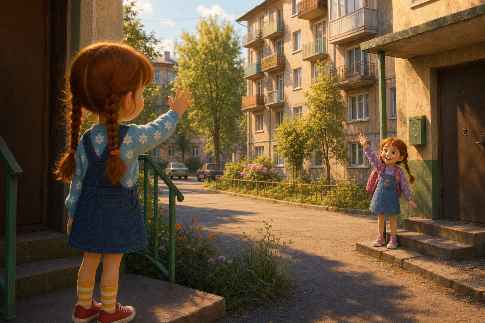
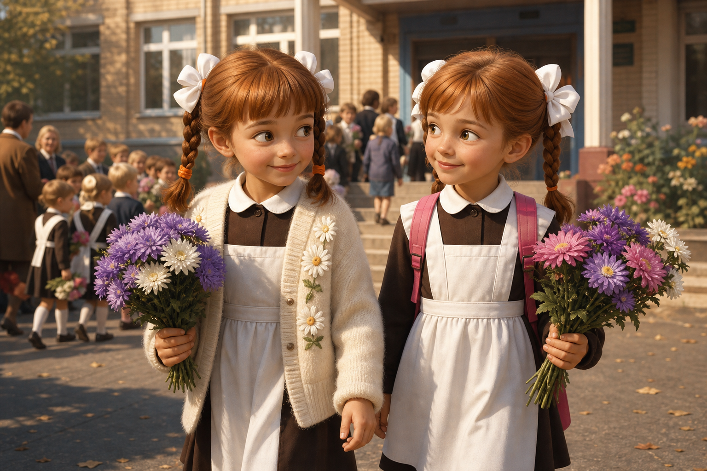
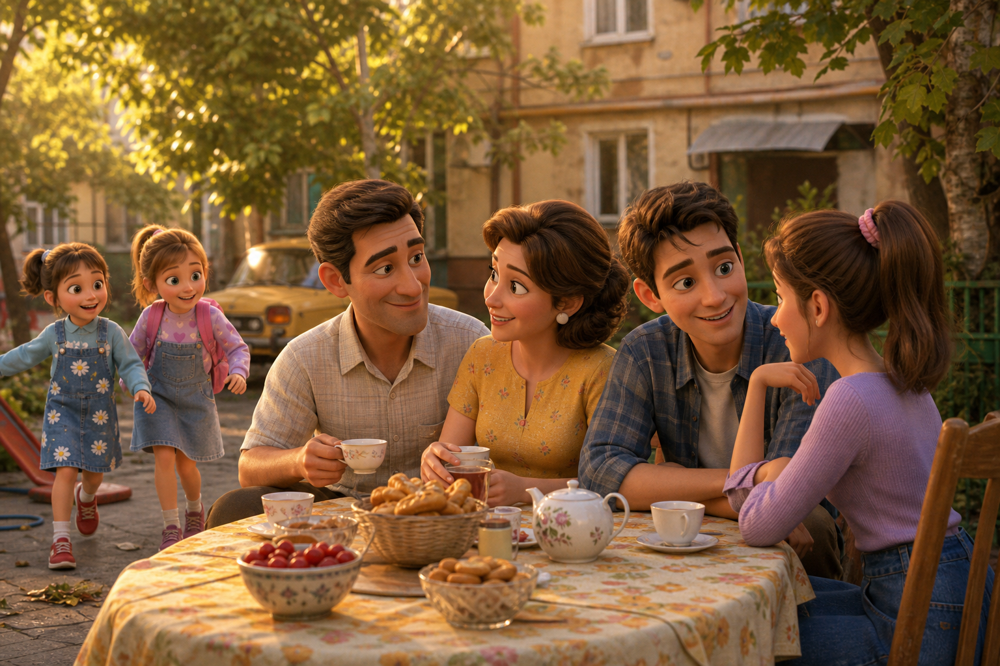
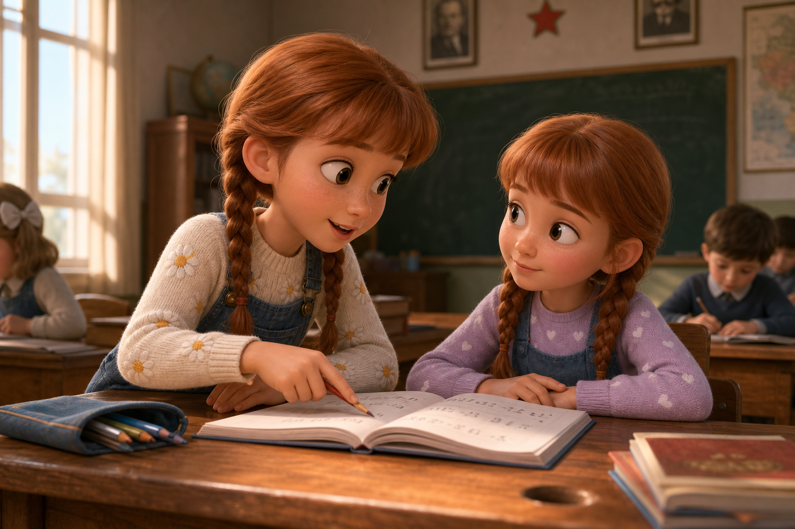
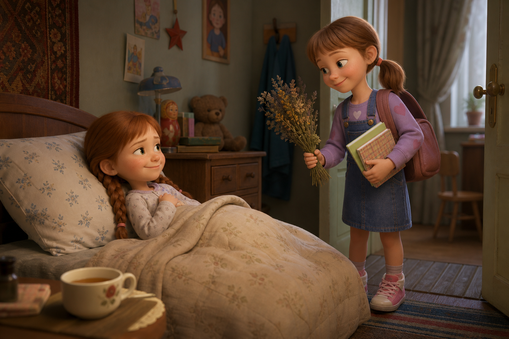
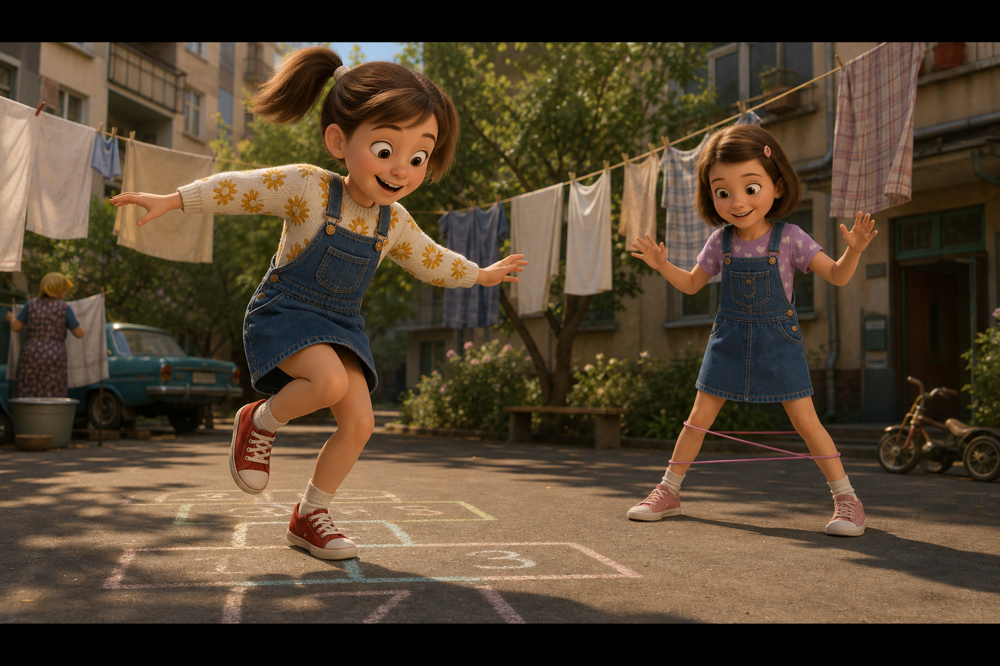
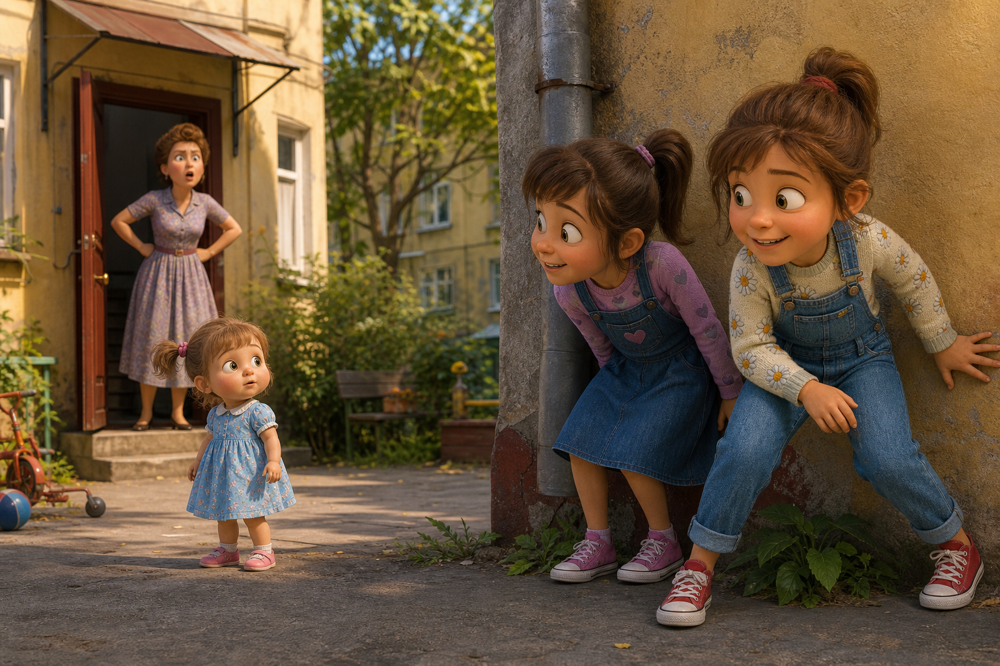
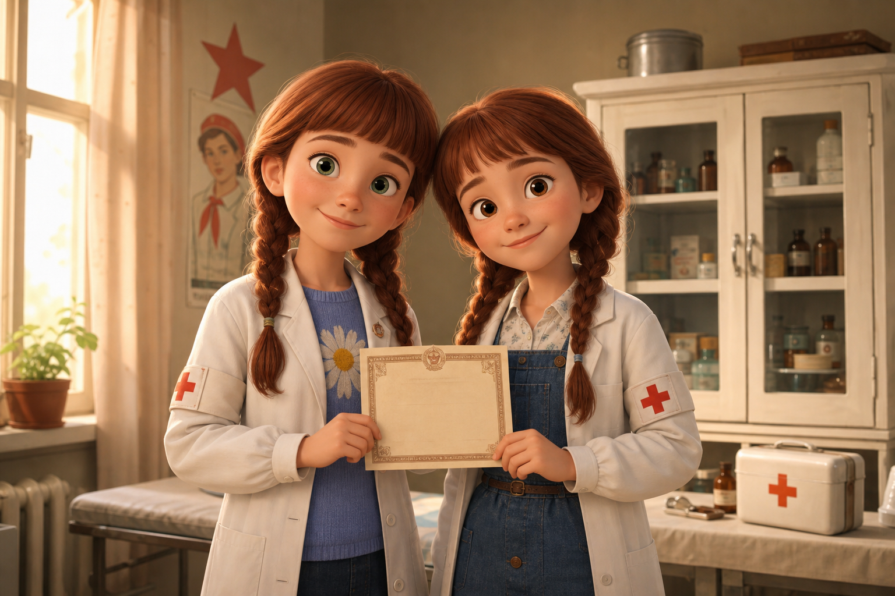
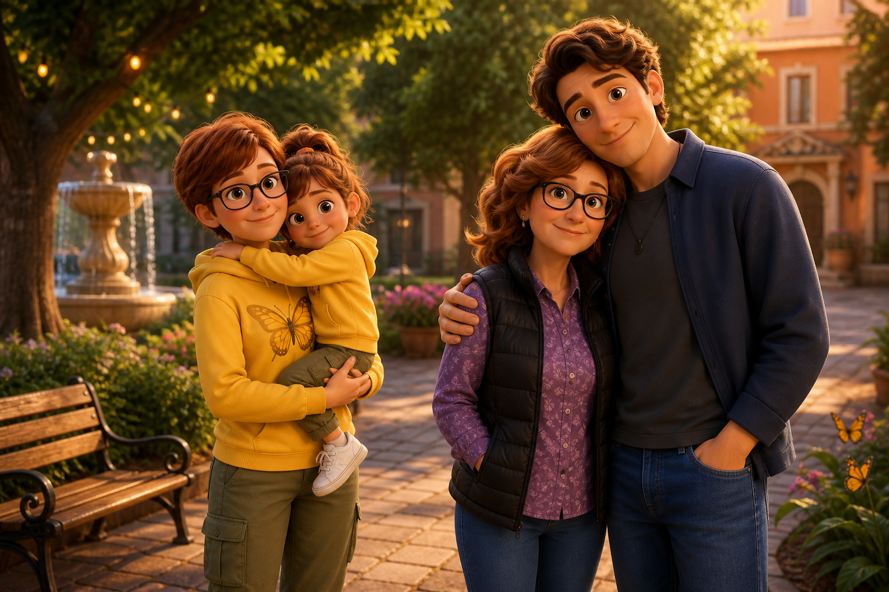
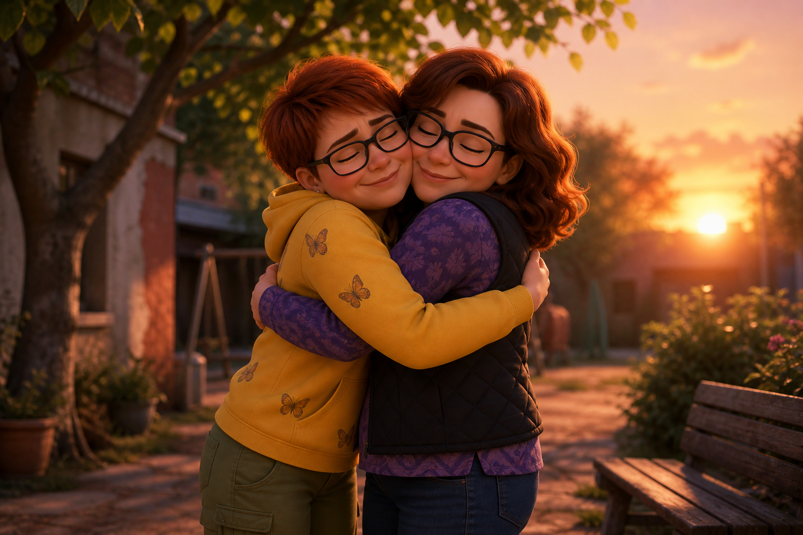

# Полная раскадровка: две Светы

**Формат:** 16:9  
**Стиль:** Pixar-like 3D / тёплый nostalgic lifestyle  
**Аудитория:** Света М — день рождения / юбилей подруги  
**Сцен:** 12  
**Хронометраж:** ~2 мин 15 сек  
**Референсы:** папка `storyboard/`

---

## Персонажи

| Кто | Детство | Взрослая |
|---|---|---|
| **Света М** (именинница) | Светло-голубой свитер с ромашками, джинсовый сарафан-комбинезон, красные кеды, жёлто-белые носки, две косы | Жёлтая худи с бабочкой, очки, оливковые карго, белые кеды |
| **Света П** (подруга) | Джинсовый сарафан с цветами на кармане, сиреневая кофта в сердечки, розовый рюкзак, розовые кеды, две косы | Фиолетовая рубашка, чёрный жилет, джинсы, очки |

---

## Сцена 1 · 0:00–0:10

**Смысл:** Две Светы — соседки в Ульяновске.  
**Визуал:** Улица Оренбургская, два двора; девочки машут друг другу из подъездов.  
**Закадр:** В Ульяновске, на улице Оренбургской, в соседних домах жили две девочки — две Светы.  
**Титр:** `Ульяновск · улица Оренбургская`  
**Настроение:** мягкий вход, акустическая гитара.



---

## Сцена 2 · 0:10–0:20

**Смысл:** 1 сентября 1978 — начало дружбы.  
**Визуал:** Школьный двор, две девочки с букетами идут к школе.  
**Закадр:** 1 сентября 1978 года они вместе пошли в первый класс — и с этого дня началась их дружба.  
**Титр:** `1 сентября 1978`  
**Настроение:** празднично, светло.



---

## Сцена 3 · 0:20–0:28

**Смысл:** Подружились семьи.  
**Визуал:** Чаепитие во дворе: родители, брат и сестра; девочки рядом.  
**Закадр:** Подружились и семьи: родители, брат одной Светы и сестра другой.  
**Настроение:** домашнее тепло.



---

## Сцена 4 · 0:28–0:36

**Смысл:** Помощь в школе.  
**Визуал:** Класс, парты; Света М объясняет задание Свете П.  
**Закадр:** В школе они всегда помогали друг другу.  
**Настроение:** спокойно, дружелюбно.



---

## Сцена 5 · 0:36–0:50

**Смысл:** Света лечит Свету травами.  
**Визуал:** Света М болеет в постели; Света П приносит тетради и травы.  
**Закадр:** Когда одна Света болела, другая в тот же день приходила с уроками и травами — и лечила подругу от простуды!  
**Настроение:** трогательно, с юмором.



---

## Сцена 6 · 0:50–1:00

**Смысл:** Игры во дворе.  
**Визуал:** Классики и резиночка; бельё на верёвках.  
**Закадр:** А во дворе они любили играть в классики и резиночки.  
**Настроение:** весело, ритмично.



---

## Сцена 7 · 1:00–1:12

**Смысл:** Анечка мешает гулять; мама Нина ругает.  
**Визуал:** Прятки от младшей сестры; мама в дверях.  
**Закадр:** Иногда забирали из садика младшую сестру Анечку. Она мешала гулять — Светы от неё прятались, а мама Нина ругала.  
**Настроение:** комично-тёплое.



---

## Сцена 8 · 1:12–1:22

**Смысл:** Юные санпостовцы.  
**Визуал:** Медпункт, белые халаты, грамота.  
**Закадр:** Светы увлекались медициной и не раз становились лучшими юными санпостовцами.  
**Титр:** `Лучшие юные санпостовцы`  
**Настроение:** гордость.



---

## Сцена 9 · 1:22–1:34

**Смысл:** Обе стали педагогами.  
**Визуал:** Взрослые Света М и Света П у доски в классе.  
**Закадр:** Детство пролетело быстро — и снова рядом: обе стали педагогами и работали в школе.  
**Настроение:** переход во взрослость.


---

## Сцена 10 · 1:34–1:48

**Смысл:** Семьи: Аллочка и Егорка.  
**Визуал:** Света М с дочкой; Света П с высоким сыном Егоркой.  
**Закадр:** Обзавелись семьями: у одной — дочка Аллочка, у другой — сын Егорка. Егорка вырос настоящим великаном — добрым и отзывчивым.  
**Настроение:** семейная теплота.



---

## Сцена 11 · 1:48–2:02

**Смысл:** Автобус «Дельфин»; Света М счастлива.  
**Визуал:** Туристический автобус; Света М у двери на трассе.  
**Закадр:** Сейчас обе уже не в школе, но дружба жива. Света путешествует по России на своём автобусе «Дельфин» — и очень счастлива.  
**Титр:** `Автобус «Дельфин»`  
**Настроение:** свобода, дорога.


---

## Сцена 12 · 2:02–2:15

**Смысл:** Финальное пожелание имениннице.  
**Визуал:** Взрослые подруги обнимаются на закате.  
**Закадр:** Желаю тебе процветания любимого дела! Оставайся такой же позитивной — ты для меня пример. Люблю тебя, Света.  
**Титр:** `Люблю тебя, Света`  
**Настроение:** кульминация тепла.



---

## Сплошной закадр (озвучка)

В Ульяновске, на улице Оренбургской, в соседних домах жили две девочки — две Светы. 1 сентября 1978 года они вместе пошли в первый класс — и с этого дня началась их дружба. Подружились и семьи: родители, брат одной Светы и сестра другой. В школе они всегда помогали друг другу. Когда одна Света болела, другая в тот же день приходила с уроками и травами — и лечила подругу от простуды! А во дворе они любили играть в классики и резиночки. Иногда забирали из садика младшую сестру Анечку. Она мешала гулять — Светы от неё прятались, а мама Нина ругала. Светы увлекались медициной и не раз становились лучшими юными санпостовцами. Детство пролетело быстро — и снова рядом: обе стали педагогами и работали в школе. Обзавелись семьями: у одной — дочка Аллочка, у другой — сын Егорка. Егорка вырос настоящим великаном — добрым и отзывчивым. Сейчас обе уже не в школе, но дружба жива. Света путешествует по России на своём автобусе «Дельфин» — и очень счастлива. Желаю тебе процветания любимого дела! Оставайся такой же позитивной — ты для меня пример. Люблю тебя, Света.

---

## Файлы референсов

```
storyboard/
  scene-01-ulyanovsk.png
  scene-02-first-september.png
  scene-03-families.png
  scene-04-school-help.png
  scene-05-herbs.png
  scene-06-yard-games.png
  scene-07-anechka.png
  scene-08-sanposts.png
  scene-09-teachers.png
  scene-10-families-kids.png
  scene-11-dolphin-bus.png
  scene-12-finale.png
```
